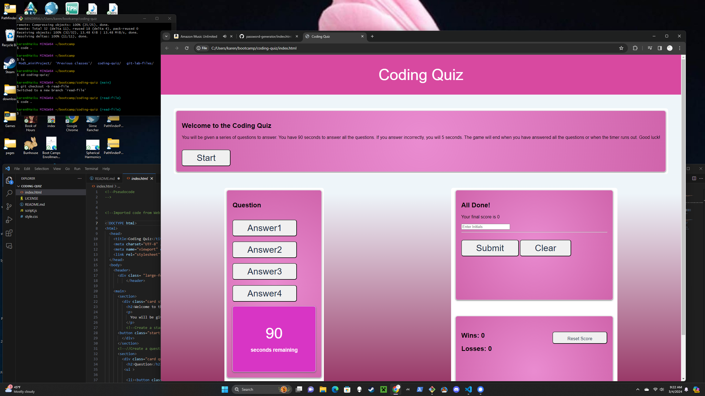

# coding-quiz
UConn Bootcamp Coding Quiz

https://khionewi.github.io/coding-quiz/
https://github.com/khionewi/coding-quiz.git

Challenge 4 - Khionewi - Dr. Karen Fioravanti

Description The What: The object is to create an interactive online quiz.

The Why: The purpose of this project is to create an interactive online multiple choice quiz. The user has the option to save their initials for a high score as well as view the record of win/loss. This is an assignment for UCONN Coding Bootcamp. It uses GitHub, code reviews, HTML, CSS and Javascript (as of 3/4/2024). 

The How: The assignment relies on our knowledge of HTML, CSS, Javascript, web APIs and GitHub.

Installation No local installation is required for this project. It can be viewed locally in the default browser. It is formatted for desktop viewing; however the screen is adaptable to accomadate mobile devices.

Usage This project was used for the Week 4 challenge for UCONN Coding Bootcamp, Jan 2024 term.

Credits I relied on knowledge from previous coursework (I hold a certificate in HTML/CSS from Anne Arundel Community College which included basic javascript) as well as the coursework for the UCONN bootcamp weeks 1 -4.

The following websites were referenced:
 https://developer.mozilla.org
https://developer.mozilla.org/en-US/docs/Web/JavaScript/Guide/Working_with_objects
https://simplestepscode.com/javascript-quiz-tutorial/

License The MIT license was used for this project.

Features This website showcases agenerating questions a user can answer while creating a win/loss record stored locally.